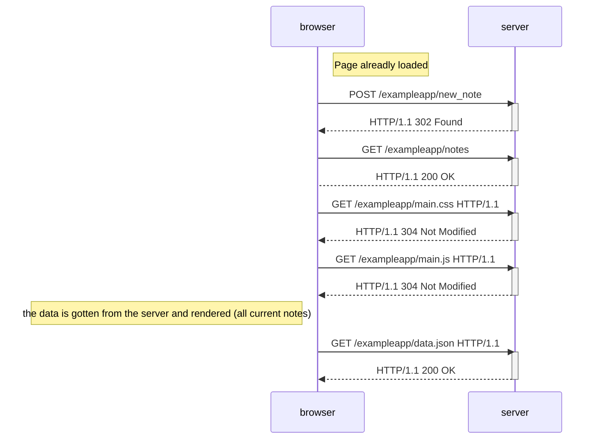

```mermaid
sequenceDiagram
  participant browser
  participant server

  Note right of browser: Page alreadly loaded

  browser->>server: POST /exampleapp/new_note
  activate server
  server-->>browser: HTTP/1.1 302 Found
  deactivate server


  browser->>server: GET /exampleapp/notes
  activate server
  server-->browser: HTTP/1.1 200 OK
  deactivate server

  browser->>server: GET /exampleapp/main.css HTTP/1.1
  activate server
  server-->>browser: HTTP/1.1 304 Not Modified
  deactivate server

  browser->>server: GET /exampleapp/main.js HTTP/1.1
  activate server
  server-->>browser: HTTP/1.1 304 Not Modified
  deactivate server

  Note left of browser: the data is gotten from the server and rendered (all current notes)
  browser->>server: GET /exampleapp/data.json HTTP/1.1
  activate server
  server-->>browser: HTTP/1.1 200 OK
  deactivate server

  
```
