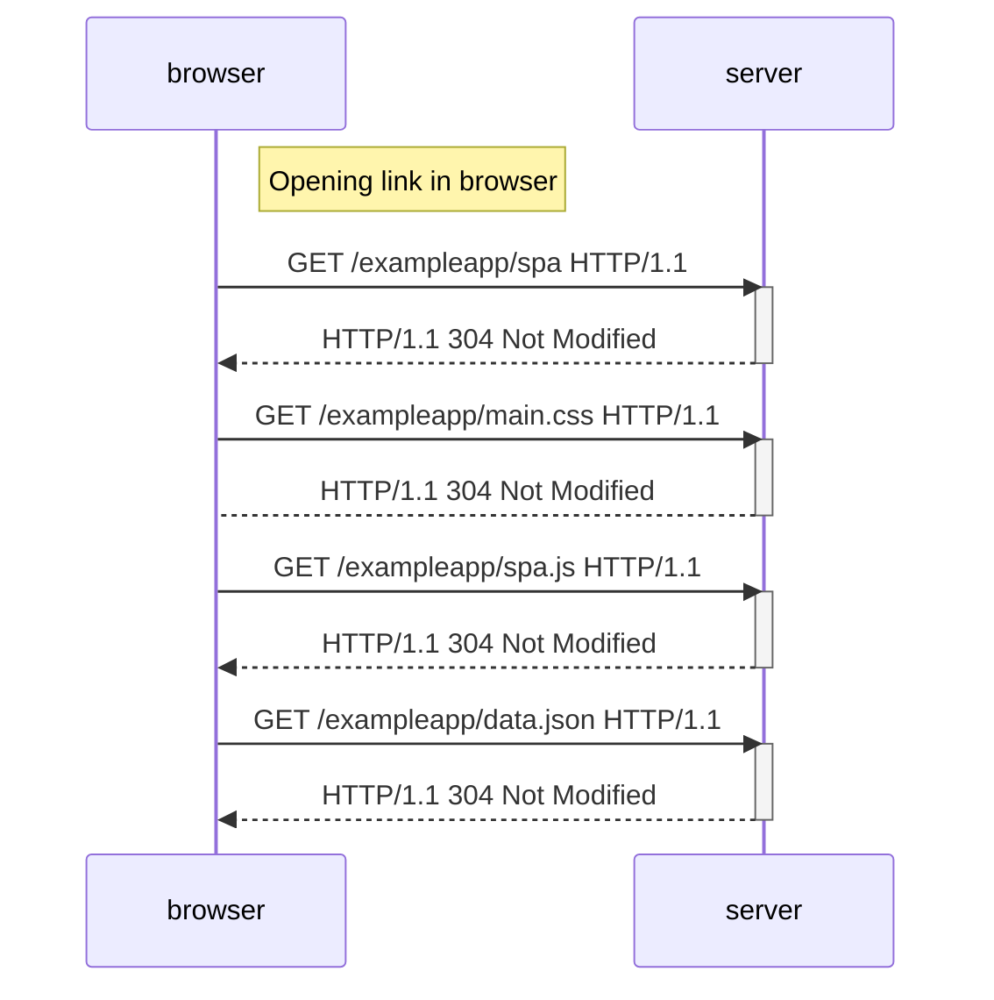

```mermaid
sequenceDiagram
  participant browser
  participant server

  Note right of browser: Opening link in browser

  browser->>server: GET /exampleapp/spa HTTP/1.1
  activate server
  server-->>browser: HTTP/1.1 304 Not Modified
  deactivate server


  browser->>server: GET /exampleapp/main.css HTTP/1.1
  activate server
  server-->browser: HTTP/1.1 304 Not Modified
  deactivate server

  browser->>server: GET /exampleapp/spa.js HTTP/1.1
  activate server
  server-->>browser: HTTP/1.1 304 Not Modified
  deactivate server

  browser->>server: GET /exampleapp/data.json HTTP/1.1
  activate server
  server-->>browser: HTTP/1.1 304 Not Modified
  deactivate server
  
```
